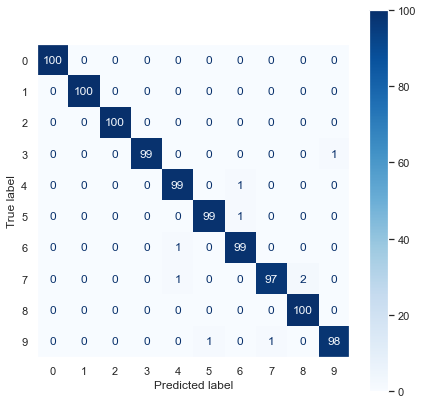
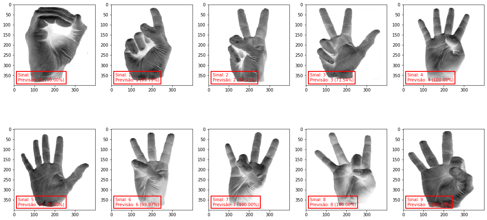

# Classificador de Dígitos ASL

Neste projeto criamos um classificador de dígitos (de 0 a 9) para a linguagem de sinais americana (*ASL - American Sign Language*).

## Resumo

Para treinar o modelo nós utilizamos uma base de dados disponível no Kaggle ([veja aqui](https://www.kaggle.com/datasets/rayeed045/american-sign-language-digit-dataset)), que consiste em 5.000 imagens (400x400px) de sinais feitos com as mãos, que representam os dígitos de 0 a 9, e estão devidamente identificados (em pastas numeradas de 0 a 9, sendo 500 imagens por dígito). Apesar das imagens serem coloridas, transformamos em preto e branco para diminuir a complexidade do nosso modelo.

Para este problema desenvolvemos um modelo de *Deep Learning* bastante simples, com apenas 4 camadas convolutivas seguidas uma camada densa, o que já se mostrou bastante satisfatório.

## Arquivos

  - *carrega_imagens.py*: Este script é responsável por carregar as imagens (do diretório *dataset*) para a memória, em forma de um *array*. Ambos notebooks incluem este script.
  - *1.treinando_o_modelo.ipynb*: Neste notebook nós criamos e treinamos o modelo de *Deep Learning* utilizando a biblioteca Keras. O modelo desenvolvido é então salvo em disco.
  - *2.utilizando_o_modelo.ipynb*: Neste notebook nós carregamos um modelo já treinado, calculamos sua acurácia no *dataset* de treino, criamos a matriz de confusão, e também avaliamos a performance do modelo em imagens inéditas (que não faziam parte do *dataset* utilizado). 

## Resultados

Após alguns ajustes nos parâmetros da CNN chegamos a uma **acurácia de 99,10%** na base de testes (modelo salvo como modelo-cnn-v20), que é bastante satisfatório para este problema. Abaixo vemos a matriz de confusão do modelo desenvolvido:

Para testarmos a robustez do modelo nós adicionamos (na pasta "meus_sinais") 10 imagens inéditas, que não fazem parte do dataset, portanto não seguem o mesmo padrão das imagens de treino. São imagens de outras mãos, em outros ambientes, porém sem fugir muito do "padrão" utilizado no treino, já que nosso modelo foi treinado com apenas 4.000 amostras. Abaixo vemos o resultado da classificação destas 10 imagens novas:

Surpreendentemente, mesmo com um dataset de treino reduzido conseguimos um bom resultado.
